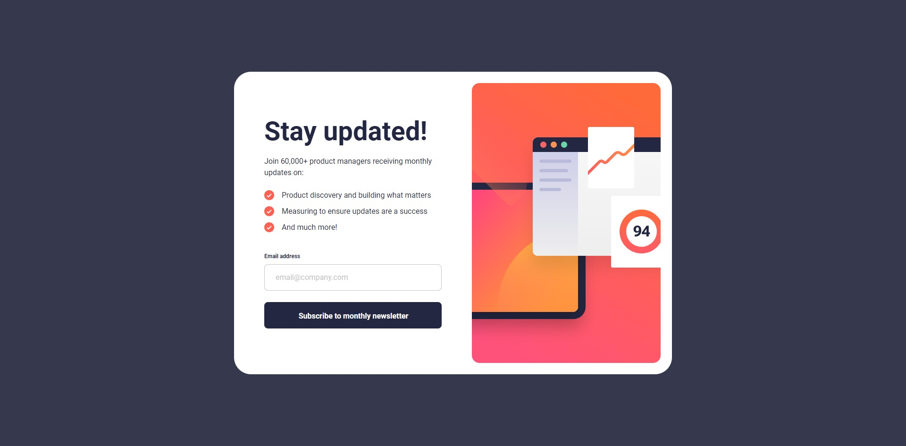

# Frontend Mentor - Newsletter sign-up form with success message solution

This is a solution to the [Newsletter sign-up form with success message challenge on Frontend Mentor](https://www.frontendmentor.io/challenges/newsletter-signup-form-with-success-message-3FC1AZbNrv). Frontend Mentor challenges help you improve your coding skills by building realistic projects. 

## Table of contents

- [Overview](#overview)
  - [The challenge](#the-challenge)
  - [Screenshot](#screenshot)
  - [Links](#links)
- [My process](#my-process)
  - [Built with](#built-with)
  - [What I learned](#what-i-learned)
  - [Continued development](#continued-development)
  - [Useful resources](#useful-resources)
- [Author](#author)

## Overview

### The challenge

Users should be able to:

- Add their email and submit the form
- See a success message with their email after successfully submitting the form
- See form validation messages if:
  - The field is left empty
  - The email address is not formatted correctly
- View the optimal layout for the interface depending on their device's screen size
- See hover and focus states for all interactive elements on the page

### Screenshot



### Links

- [Solution URL](https://github.com/NikaDalalishvili/newsletter-sign-up-form-with-success-message)
- [Live Site URL](https://nikadalalishvili.github.io/newsletter-sign-up-form-with-success-message/)

## My process

### Built with

- Semantic HTML5 markup
- CSS custom properties
- Flexbox
- Mobile-first workflow
- [SCSS](https://sass-lang.com) - Sassy Cascading Style Sheets

### What I learned

Actually, nothing special, the challenges that were in the project, I already had experience with them. What was probably less known to me was the input validation check in Javascript.

```js
const userInput = document.getElementById("user-input");
if(!userInput.checkValidity()) {}
```

### Continued development

First I want to finish the javascript course I'm taking on freecodecamp, I'm also going through the learning path on Frontendmentor, and after that I want to focus more on React, Next.js and Node.js.

### Useful resources

- [ChatGPT](https://chatgpt.com/) - He is my hero, if I need something fast, if I can't understand something, or if I can't find it on the internet, I always ask him.
- [W3Schools](https://www.w3schools.com/) - This is my favorite documentation platform I've been using since I started programming, it's the best explained resource.
- [YouTube](https://www.youtube.com/) - I'm always looking for news and listening to other developers, sharing their experiences so that I can see many different solutions to a problem.

## Author

- Frontend Mentor - [@NikaDalalishvili](https://www.frontendmentor.io/profile/NikaDalalishvili)
- Instagram - [@nika.dala](https://www.instagram.com/nika.dala/)
- TikTok - [@nika.dala](https://www.tiktok.com/@nika.dala)
- YouTube - [@nikadala](https://www.youtube.com/@nikadala)
